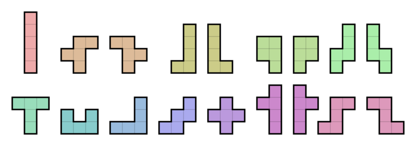

<h1 align="center">Dans le cadre de mon stage de licence</h1>

# Énumération des polyominos reposant sur les grammaires algébriques (Méthode DSV)

On propose ici une implémentation fonctionnelle en OCaml de la méthode DSV (Delest-Viennot)
pour énumérer des polyominos au travers de grammaires algébriques.
Réalisé durant mon stage de recherche au laboratoire **GR2IF** (Groupe de Recherche Rouennais en 
Informatique Fondamentale), Université de Rouen.

# Qu'est-ce qu'un polyomino ?

Les polyominos sont des figures géométriques discrètes formées de cellules carrées connexes.
Leur énumération est un problème central en combinatoire, avec des applications en physique 
statistique, modélisation de percolation, repliement de protéines, ou encore en informatique 
dans des problèmes de compression ou de pavage.

**À ce jour, il est impossible d'énumérer tous les polyominos.** Le nombre total de polyominos
de taille n croît exponentiellement, et aucune formule close ni série génératrice n'est connue
pour la classe entière. C'est un problème ouvert depuis plus de 60 ans.

La méthode DSV ne résout pas ce problème général, elle offre un cadre rigoureux pour énumérer
certaines **sous-classes bien choisies**.
# La méthode DSV

La méthode DSV consiste à établir une bijection entre les mots générés par une grammaire 
algébrique et des polyominos. Dès lors que cette bijection est établie, on traduit la grammaire
en un système d'équations sur les séries formelles.

## Exemple : mots de Dyck et polyominos parallélogrammes

Un **mot de Dyck** de longueur $2n$ est un mot sur $\{a, b\}$ tel que :
- le mot contient exactement $n$ lettres $a$ et $n$ lettres $b$
- tout préfixe contient au moins autant de $a$ que de $b$

Ils sont comptés par les **nombres de Catalan** :

$$C_n = \frac{1}{n+1}\binom{2n}{n} \implies 1, 1, 2, 5, 14, 42, 132, \dots$$

Les mots de Dyck sont engendrés par la grammaire :

$$S \to \varepsilon \mid a \, S \, b \, S$$

Cette grammaire donne directement l'équation fonctionnelle sur la série génératrice 
$C(x) = \sum_{n \geq 0} C_n x^n$ :

$$C(x) = 1 + x \cdot C(x)^2 \implies C(x) = \frac{1 - \sqrt{1 - 4x}}{2x}$$

Les mots de Dyck encodent les **polyominos parallélogrammes** : chaque montée $a$ 
correspond à un pas vers le haut, chaque descente $b$ à un pas vers la droite. 
Le chemin trace le contour supérieur du polyomino.

C'est l'un des premiers exemples historiques de la méthode DSV : la bijection entre 
mots de Dyck et polyominos parallélogrammes permet d'énumérer ces derniers par périmètre,
et prouve que leur série génératrice est **algébrique**.
# Caractéristiques

- Définir une grammaire algébrique avec terminaux, non-terminaux et epsilon
- Générer tous les mots d'une grammaire selon des bornes configurables
- Filtrage paramétré à l'aide de fonctions de mesure (`fl`) et de bornes (`bl`)
- Gestion des grammaires récursives et ambiguës sans débordement de pile

# Fonctionnement

La fonction principale **iter** prend en argument une grammaire `g`, une liste de fonctions 
de mesure `fl` et une liste de bornes `bl`, toutes deux de même longueur.

À chaque nouvelle dérivation, l'invariant **∀ i, fl[i](w) ≤ bl[i]** est vérifié.
Si l'invariant n'est plus satisfait, la branche est élagée. Cela garantit la terminaison
du programme tout en restant entièrement paramétrable.
